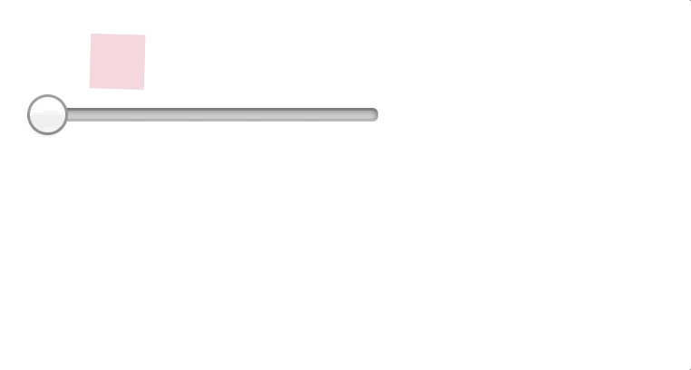

# Animated Timeline

> Create playback based animations in React 💫

## Table of contents

* [Introduction](#introduction)

* [Motivation](#another-animation-library)

* [Install](#install)

* [Browser support](#browser-support)

* [Usage](#usage)

* [Documentation](#documentation)

* [Contributing](#contributing)

* [License](#license)

## Introduction 👋🏻

**animated-timeline** is an animation library for React which makes it painless to create playback based animations. It is inspired from [animatedjs](https://github.com/animatedjs/animated) and [anime](https://github.com/juliangarnier/anime). It focuses on improving the developer experience.

## Another animation library ? 👀

No, it's not an animation library. Though you can use it as a library or extract some part of this project because `animated-timeline` exposes playback based APIs to perform animations and provides some other utilities like altering the animation position, APIs for performing spring based animations etc but the main goal of this project is to -

* provide utilities to create animation tools.

* create a fitting abstraction on top of this project.

* provide APIs for composing animations that transition from one state to another, use loops, callbacks and timer APIs to create interactive animations.

## Features ☄️

* Controls for time-based execution of an animation

* Create sequence based animations

* Change the animation position along the timeline by seeking the animation

* Keyframes

* Promise based APIs

* Interactive animations based on changing inputs

## Performance 🔥

* Style mutations and style reads are batched to speed up the performance and avoid document reflows.

* Uses `will-change` but in an optimal way to avoid high memory consumption

## Install 👨🏼‍💻

```
npm install animated-timeline
```

or if you use yarn

```
yarn add animated-timeline
```

> Note - This project is not experimental and doesn't require a polyfill. See [browser usage](#browser-usage).

**This project also depends on `react` and `react-dom` so make sure you've them installed.**

## Browser support ⚙️

| Chrome | Safari | IE / EDGE | Firefox | Opera |
| ------ | :----: | --------: | ------: | ----: |
| 24+    |   6+   |       10+ |     32+ |   15+ |

## Usage 🎮

`animated-timeline` provides three ways to do animations:

* [Component API](./docs/Component.md)

* [Timeline API](./docs/Timeline.md)

* [Spring physics and bounciness](./docs/Spring.md)

**Example usage with component API**

```js
import React, { Component } from 'react'
import { Animate, helpers } from 'animated-timeline'

const styles = {
  width: '20px',
  height: '20px',
  backgroundColor: 'pink',
  marginTop: 30
}

export function App() {
  return (
    <Animate
      timingProps={{
        duration: 1000
      }}
      animationProps={{
        rotate: {
          value: helpers.transition({ from: 360, to: 180 })
        }
      }}>
      <div style={styles} />
    </Animate>
  )
}
```

<p align="center">
  
</p>

[Read the detailed API reference for `Animate` component]()

**Example usage with `Timeline` API**

```js
import React from 'react'
import { Timeline, helpers } from 'animated-timeline'

const styles = {
  width: '20px',
  height: '20px',
  backgroundColor: 'pink'
}

// Define timeline model properties
const Animated = Timeline({
  direction: 'alternate',
  iterations: 1
})

class App extends React.Component {
  componentDidMount() {
    // Define animation model properties
    Animated.value({
      elements: this.one,
      opacity: helpers.transition({ from: 0.2, to: 0.8 }),
      rotate: {
        value: helpers.transition({ from: 360, to: 180 })
      }
    }).start()
  }

  render() {
    return <div ref={(one) => (this.one = one)} style={styles} />
  }
}
```

> **Note** - You can also use selectors like '.xyz' or '#xyz' along with refs or an array of elements like `[this.one, '.xyz', '#xyz']` and pass it to `elements` property.

[Read the detailed API reference for `Timeline` API]()

**Example usage with spring physics and bounciness**

```js
import React from 'react'

import { Spring } from 'animated-timeline'

const styles = {
  width: '20px',
  height: '20px',
  backgroundColor: 'pink'
}

const spring = Spring({ friction: 4, tension: 2 })

export class SpringSystem extends React.Component {
  componentDidMount() {
    spring.animate({
      element: this.one,
      property: 'scale',
      options: {
        mapValues: {
          input: [0, 1],
          output: [1, 1.5]
        }
      }
    })
  }

  render() {
    return (
      <div style={{ margin: '0 auto', width: '50%' }}>
        <div
          ref={(one) => (this.one = one)}
          onMouseUp={() => spring.setValue(0)}
          onMouseDown={() => spring.setValue(1)}
          style={styles}
        />
      </div>
    )
  }
}
```

<p align="center">
  
</p>

[Read the detailed API reference for spring physics and bounciness]()

## Brief

To animate an element, you will need to specify properties for timing model like `duration`, `delay`, `iterations` and animation model like `elements` for animating an element or an array of elements, `transform`, `color`, `opacity` etc.

**Timing model**

The timing model describes the current time and an animation's progress.

**Animation model**

The animation model, on the other hand, describes how an animation could look like at any give time or it can be thought of as state of an animation at a particular point of time.

## Animation types 🌀

### Sequence based animations

[See example code for sequence based animations](./examples/Sequence.js)

<p align="center">
  
</p>

### Timing based animations

[See example code for timing based animations](./examples/Timing.js)

<p align="center">
  
</p>

### Keyframes

[**See example code for keyframes**](./examples/Keyframes.js)

<p align="center">
  
</p>

### Changing the animation duration

You can also change the animation duration using an input value. In the below example, we are passing the value for the input type `range`.

[See example code](./examples/Mover.js)

<p align="center">
  
</p>

### Spring based animations

[See example code for spring based animations](./examples/Spring.js)

<p align="center">
  
</p>

### More examples

See more examples for -

* [**Animating multiple instances**](./examples/MultipleInstance.js)

* [**Managing animation lifecycle**](./examples/Lifecycle.js)

* [**Using promise based APIs to control `initialisation` and `cancellation` events for an animation**](./examples/PromiseAPI.js)

<br/>
**If that sounds interesting**, [**then let's dive into the detailed documentation which covers example use cases, API reference, and some more examples**](./docs)

## Challenges / Todos 😴

* [ ] ReasonML port of the core engine

* [ ] timing model based on scroll position and gestures ?

## Contributing 🤝

[See the contributing guide](./CONTRIBUTING.md)

## License

MIT
