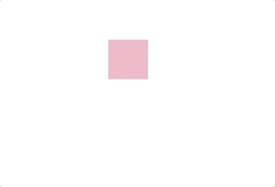
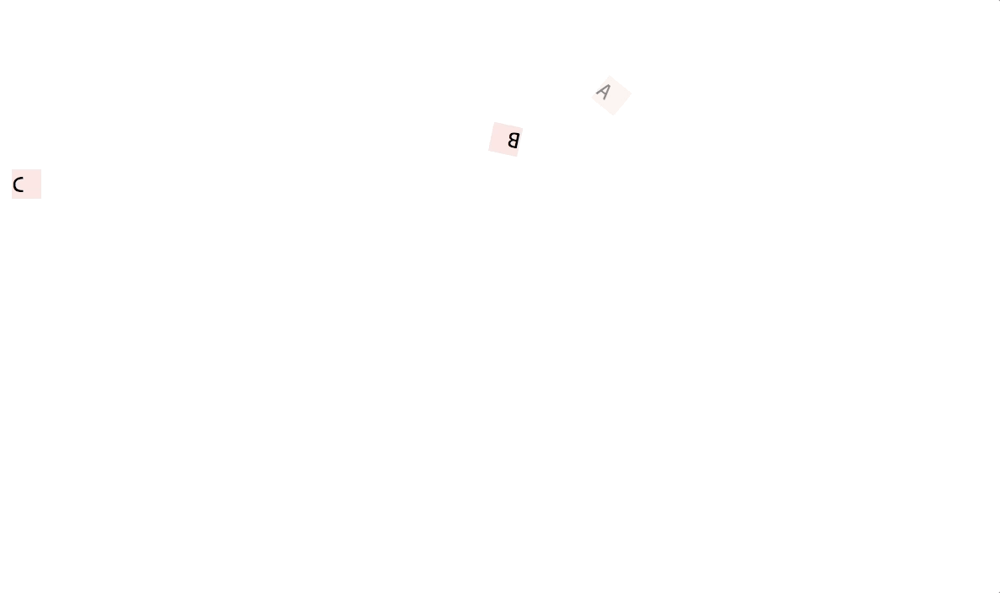
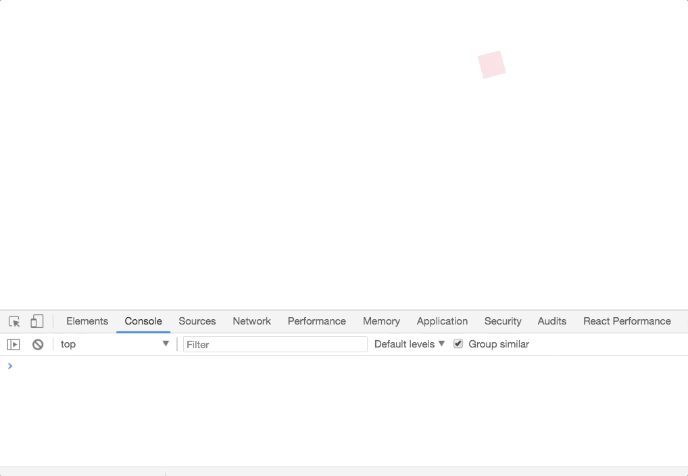

# Timeline

<br/><br/>

<p align="center">
  
</p>

> Create timeline and playback based animations in React

## Table of contents

* [Introduction](#introduction)

* [Install]()

* [Browser support]()

* [Usage]()

* [Reference]()

* [Contributing]()

* [License]()

## Introduction

**Timeline** is an animation library for React which makes it painless to create timeline and playback based animations. It is inspired from the existing physics based models and is here just because of the hard work that has already been done by the great developers. It focuses on improving the developer experience and has an API which is relatively similar to React Native. It also shares the same philosophy with React Native which is -

> **_focus on declarative relationships between inputs and outputs, with configurable transforms in between, and simple start/stop methods to control time-based animation execution._**

Along with `start` and `stop` methods it also provides -

* `restart` - To replay the animation

* `reset` - To reset animation timeline

* `reverse` - To reverse the animation

* `seek` - An interactive way to control the animation throughout it's progress.

It also provides lifecycle hooks that gets executed during different phases of an animation. Read more [here]()

Besides the library usage, **Timeline** aims to amplify the usage of interaction design in our development process and also encourages to create interactive tools on top of the API that it already provides to create animations.

## Features

* Provides controls for time-based execution of an animation

* Let's you create sequence based animations

* Provides lifecycle hooks which gets executed in different phases of an animation

* Dynamically change the animation progress or sync the animation progress (or duration) value with an input value

## Install

```
npm install animated-timeline
```

or if you use yarn

```
yarn add animated-timeline
```

**This library also depends on `react` and `react-dom` so make sure you've already installed it.**

## Usage

```js
import React, { Component } from "react";

import { Timeline, helpers } from "animated-timeline";

const { start } = helpers;

const timeline = new Timeline({
  direction: "alternate",
  easing: "easeInOutSine",
  loop: true,
  duration: 2000
});

const { Animated } = timeline.init();

class App extends Component {
  componentDidMount() {
    Animated.value({
      elements: this.one,
      translateX: start({ from: 500, to: 10 }),
      opacity: start({ from: 0.4, to: 0.9 }),
      rotate: {
        value: 360,
        easing: "easeInOutSine"
      }
    }).start();
  }

  render() {
    return (
      <div
        ref={one => (this.one = one)}
        style={{
          width: "20px",
          height: "20px",
          backgroundColor: "pink"
        }}
      />
    );
  }
}
```

**Result**

<p align="center">
  
</p>

In the above example, we created a `timeline` instance by passing an object of animation attributes to the `Timeline` class constructor. The animation attributes are used to configure an animation timeline so you can decide what should be `direction`, `easing`, `duration` value etc, throughout the animation timeline.

> Note - Defining animation attributes is optional and can be skipped.

After that, we initialise the timeline by calling the instance method `init` on our timeline instance. This returns the main `Animated` object and also an `AnimationTimeline` component (we will look into this later).

The `Animated` object is used to hook up one or more style attributes of an element or elements which you want to animate. This is done by calling `.value()` on `Animated` and passing an object of animatable properties.

You will need to specify a selector (`className`, `id` or a reference to the element) to animate an element otherwise `Animated` won't be able to infer which elements are supposed to be animated.

**classname**

```js
// Element to be animated
<div className="sample" />;

// Specify the element and animation properties
Animated.value({
  // Element with class 'sample'
  elements: ".sample",
  translateX: 400,
  rotate: {
    value: 360,
    direction: "alternate"
  }
});
```

**id**

```js
// Element to be animated
<div id="sample" />;

// Specify the element and animation properties
Animated.value({
  // Element with class 'sample'
  elements: "#sample",
  translateX: 400,
  rotate: {
    value: 360,
    direction: "alternate"
  }
});
```

**refs**

```js
// Element to be animated
<div ref={sample => (this.sample = sample)} />;

Animated.value({
  elements: this.sample,
  translateX: 400,
  rotate: {
    value: 360,
    direction: "alternate"
  }
});
```

You can also pass an array of elements to the property `elements` to animate a group of elements with similar properties like -

```js
Animated.value({
  // Element with class 'sample'
  elements: [this.sample, '.one', '#two', .three],
  translateX: 400,
  rotate: {
    value: 360,
    direction: 'alternate'
  }
})
```

`Animated.value` can bind to style properties, and can also be chained for performing sequence based animations (we will look into this later). A single `Animated.value` can drive any number of properties (similar to [React Native]())

Now to start the animation, call `.start()` on Animated.

```js
Animated.value({ ...props }).start();

// or

Animated.value({
  ...props
});

// Starts the animation
Animated.start();
```

### Working with animations

#### Playback based animations

You can also use playback controls to control the execution of an animation via `start` and `stop` methods. Let's take an example -

```js
import React, { Component } from "react";

import { Timeline, helpers } from "animated-timeline";

const { start } = helpers;

const timeline = new Timeline({
  direction: "alternate",
  easing: "easeInOutSine",
  loop: true,
  duration: 2000
});

const { Animated } = timeline.init();

class App extends Component {
  componentDidMount() {
    Animated.value({
      elements: this.one,
      translateX: start({ from: 500, to: 10 }),
      opacity: start({ from: 0.4, to: 0.9 }),
      rotate: {
        value: 360,
        easing: "easeInOutSine"
      }
    });
  }

  render() {
    return (
      <React.Fragment>
        <div
          ref={one => (this.one = one)}
          style={{
            width: "20px",
            height: "20px",
            backgroundColor: "pink"
          }}
        />
        <button onClick={e => Animated.start()}>Play</button>
        <button onClick={e => Animated.stop()}>Pause</button>
      </React.Fragment>
    );
  }
}
```

<p align="center">
  
</p>

Simple 😃

#### Sequence based animations

You can also do sequence based animations by chaining up multiple values using `.value` on `Animated` object. Let's take an example -

```js
import React, { Component } from "react";

import { Timeline, helpers } from "animated-timeline";

const { start } = helpers;

const timeline = new Timeline({
  direction: "alternate",
  easing: "easeInOutSine",
  loop: true,
  duration: 2000
});

const { Animated } = timeline.init();

class App extends Component {
  componentDidMount() {
    Animated.value({
      elements: this.one,
      translateX: start({ from: 500, to: 10 }),
      opacity: start({ from: 0.4, to: 0.9 }),
      rotate: {
        value: 360,
        easing: "easeInOutSine"
      }
    })
      .value({
        elements: ".two",
        translateX: start({ from: 10, to: 500 }),
        opacity: start({ from: 0.2, to: 0.5 })
      })
      .value({
        elements: "#three",
        translateX: start({ from: 300, to: 700 }),
        opacity: start({ from: 0.4, to: 0.6 }),
        rotate: {
          value: 180,
          easing: "easeInOutSine",
          direction: "alternate"
        }
      });

    Animated.start();
  }

  render() {
    const styles = {
      width: "20px",
      height: "20px",
      backgroundColor: "pink",
      marginTop: 10
    };

    return (
      <React.Fragment>
        <div ref={one => (this.one = one)} style={styles} />
        <div className="two" style={styles} />
        <div id="three" style={styles} />
      </React.Fragment>
    );
  }
}
```

<p align="center">
  
</p>

#### Timing based animations

You can also define timing based animations by using the `helpers` utilities from `animated-timeline`. We will be using `start`, `startAfter` and `startBefore` methods from `helpers` to create timing based animations.

> See a list of available methods on `helpers` [here]()

* `start()` - This method is used to perform `from-to` based animations i.e transition from one value to another

* `startAfter(time)` - This method is used to start the animation at a specified time in seconds after the previous animation ends.

* `startBefore(time)` - This method is used to start the animation at a specified time in seconds before the previous animation ends.

Let's take an example -

```js
import React, { Component } from "react";

import { Timeline, helpers } from "animated-timeline";

const { start, startBefore, startAfter } = helpers;

const timeline = new Timeline({
  direction: "alternate",
  easing: "easeInOutSine",
  loop: true,
  speed: 0.5
});

const { Animated } = timeline.init();

export class TimelineOffset extends Component {
  componentDidMount() {
    Animated.value({
      elements: this.one,
      translateX: start({ from: 500, to: 20 }),
      opacity: start({ from: 0.4, to: 0.9 }),
      rotate: {
        value: 180
      }
    })
      .value({
        elements: this.two,
        translateX: start({ from: 10, to: 600 }),
        elasticity: 900,
        rotate: {
          value: 360,
          easing: "easeInOutSine"
        },
        // Start animating this 1.2s before the previous animation ends
        offset: startBefore(1200)
      })
      .value({
        elements: this.three,
        translateX: 500,
        elasticity: 1000,
        // Start animating this 1.1s after the previous animation ends
        offset: startAfter(100)
      });

    Animated.start();
  }

  render() {
    const boxStyles = {
      width: "20px",
      height: "20px",
      backgroundColor: "mistyrose",
      marginTop: 10
    };

    return (
      <React.Fragment>
        <div ref={one => (this.one = one)} style={boxStyles}>
          A
        </div>
        <div ref={two => (this.two = two)} style={boxStyles}>
          B
        </div>
        <div ref={three => (this.three = three)} style={boxStyles}>
          C
        </div>
      </React.Fragment>
    );
  }
}
```

<p align="center">
  
</p>

The `helpers` utilities provides the following methods -

* `start()` - This method is used to perform `from-to` based animations i.e transition from one value to another

* `startAfter(time)` - This method is used to start the animation at a specified time in seconds after the previous animation ends.

* `startBefore(time)` - This method is used to start the animation at a specified time in seconds before the previous animation ends.

* `random(a, b)` - Returns a random number between `a` and `b`

* `getEasings()` - Returns the available easing values

* `createCurve(curveName, controlPoints)` - Takes a curve name and array of four control points, and creates a new easing curve.

* `times(number)` - Starts the animation at a specified (number) `times` the previous animation's duration.

#### Changing the animation progress

You can also dynamically change the animation progress (or duration) value using the `AnimationTimeline` component.

```js
import React, { Component } from "react";

import { Timeline, helpers } from "animated-timeline";

const { start } = helpers;

const timeline = new Timeline({
  direction: "alternate",
  easing: "easeInOutSine",
  loop: true,
  duration: 2000
});

const { Animated, AnimationTimeline } = timeline.init();

class App extends Component {
  state = {
    value: 0
  };

  componentDidMount() {
    Animated.value({
      elements: this.one,
      translateX: start({ from: 500, to: 10 }),
      opacity: start({ from: 0.4, to: 0.9 }),
      rotate: {
        value: 360,
        easing: "easeInOutSine"
      }
    });
  }

  handleChange = e => this.setState({ value: e.target.value });

  render() {
    return (
      <AnimationTimeline seek={ctrl => ctrl.default(this.state.value)}>
        <div
          ref={one => (this.one = one)}
          style={{
            width: "20px",
            height: "20px",
            backgroundColor: "pink"
          }}
        />
        <input
          type="range"
          min="0"
          max="100"
          value={this.state.value}
          onChange={this.handleChange}
        />
      </AnimationTimeline>
    );
  }
}
```

<p align="center">
  
</p>

`seek` prop accepts a function with an argument `ctrl`. `ctrl` is an object which is used to sync the animation progress value with the input value, in our case `this.state.value`. It provides two methods - `default` and `custom`.

* `default` - The default method accepts an input value which will be synced with the animation progress value. This is the built-in, so you don't need to worry about it.

* `custom` - In some cases, you will need to sync the animation progress with a different offset. In those cases, you can pass a callback to the `custom` method like so -

```js
function callback({ progress }) {
  const value = 50
  const offset = 5

  return ((value * offset) * (progress / 100))
}

<AnimationTimeline seek={ctrl => ctrl.custom(callback)}>
```

<p align="center">
  
</p>

**Note** - The callback function should return a number value.

The callback function receives [these parameters]().

#### Lifecycle hooks

You can also manage the animation lifecycle and execute some logic in different phases of your animation. For example - After an animation has been completed, we will reverse it direction and restart the animation again.

```js
import React, { Component } from "react";

import { Timeline, helpers } from "animated-timeline";

const { start } = helpers;

const timeline = new Timeline({
  direction: "alternate",
  easing: "easeInOutSine",
  speed: 0.09
});

const { Animated, AnimationTimeline } = timeline.init();

export class App extends Component {
  componentDidMount() {
    Animated.value({
      elements: this.one,
      translateX: start({ from: 500, to: 10 }),
      opacity: start({ from: 0.4, to: 0.9 }),
      rotate: {
        value: 360,
        easing: "easeInOutSine"
      }
    }).start();
  }

  render() {
    return (
      <React.Fragment>
        <AnimationTimeline
          lifecycle={{
            onComplete: ({ completed }) => {
              console.log("Completed: " + completed);
              console.log("Starting again...");

              if (completed) {
                // Reverse the direction
                Animated.reverse();

                // Restart the animation
                Animated.restart();
              }
            }
          }}
        />
        <div
          ref={one => (this.one = one)}
          style={{
            width: "20px",
            height: "20px",
            backgroundColor: "pink"
          }}
        />
      </React.Fragment>
    );
  }
}
```

<p align="center">
  
</p>

[Learn more animation lifecycle hooks]()

## Browser support

| Chrome | Safari | IE / EDGE | Firefox | Opera |
| ------ | :----: | --------: | ------: | ----: |
| 24+    |   6+   |       10+ |     32+ |   15+ |
