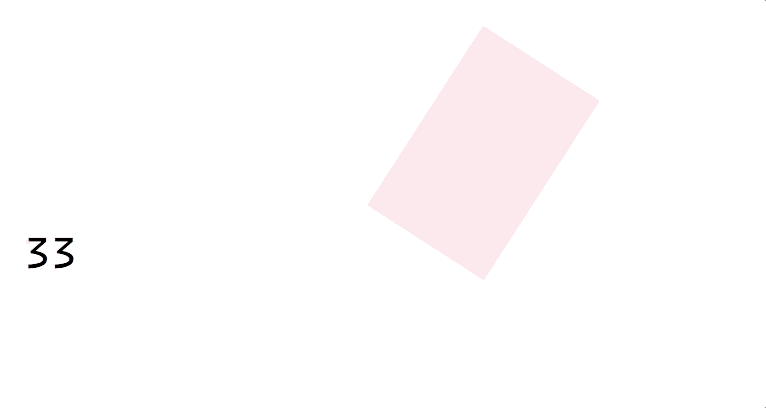

# API Reference

API reference for `animated-timeline`

### `Timeline`

Returns a new `Timeline` instance which is used to animate the elements. `Timeline` function accepts an object of timeline properties.

**Example**

```js
const timeline = Timeline({
  delay: 2000,
  duration: 4000,
  direction: 'alternate',
  easing: 'easeInSine'
})
```

**Timeline properties**

Below are the timeline properties which you can pass to `Timeline` function.

* `delay` (ms) - Animation delay

* `duration` (ms) - Animation duration

* `direction` (`normal`, `reverse` or `alternate`) - Animation direction

* `speed` - Animation speed. This sets the speed for all the elements being animated using the same `Animated` instance.

* `iterations` - Can be a number value or `Infinity`

* `easing` - Eg - `easing: 'easeInSine'.` Available `easing` curves are

```js
// Default
'linear'

// easeIn
'easeInQuad'
'easeInCubic'
'easeInQuart'
'easeInQuint'
'easeInSine'
'easeInExpo'
'easeInCirc'
'easeInBack'
'easeInElastic'

// easeOut
'easeOutQuad'
'easeOutCubic'
'easeOutQuart'
'easeOutQuint'
'easeOutSine'
'easeOutExpo'
'easeOutCirc'
'easeOutBack'
'easeOutElastic'

// easeInOut
'easeInOutQuad'
'easeInOutCubic'
'easeInOutQuart'
'easeInOutQuint'
'easeInOutSine'
'easeInOutExpo'
'easeInOutCirc'
'easeInOutBack'
'easeInOutElastic'
```

* `elasticity` (`Number`)

* `offset` (`Number`) - Used for performing timing based animations.

* `autoplay` (`Boolean`) - Default is `true`.

### `Animated`

`Animated` object accepts animation properties for an element you want to animate via `.value()`.

```js
const Animated = Timeline({
  ...props
})

Animated.value({
  elements: '.xyz',
  rotate: {
    value: 180,
    duration: 2000
  },
  scale: 2
})
```

You can pass an object of animation properties using the method `.value()`.

`.value()` can further be chained to perform sequence based animations or timing based animations.

**Using .value() for sequence based animations**

```js
Animated.value({
  // Animate the element with selector '.one'
  elements: '.one',
  ...props
}).value({
  // then animate the element with selector '.two'
  elements: '.two',
  ...props
})
```

**Using .value() for timing based animations**

To perform timing based animations, you will need to pass an offset value for an element. The `offset` value determines when to start the animation i.e after the previous animation, before the previous animation or at n times the previous animation.

```js
Animated.value({
  elements: '.one',
  ...props
})
  .value({
    elements: '.two',
    // Start at 2000 after the previous animation ends
    offset: helpers.startAfter(2000)
  })
  .value({
    elements: '.three',
    // Start at 2000 before the previous animation ends
    offset: helpers.startBefore(1200)
  })
```

Learn more about the methods [`startBefore`](#startBefore) and [`startAfter`](#startAfter)

**Animation properties**

* `elements` - Specify an element or an array of elements you want to animate through selectors or refs (React)

```js
Animated.value({
  elements: [this.one, '.two', '#three']
})

// Assuming these are the elements we want to animate
render() {
  return (
    <div>
      <div id="three" />
      <div ref={(one) => this.one = one} />
      <div className="two" />
    </div>
  )
}
```

* `css` properties - CSS properties you want to animate like `opacity`, `fontSize`, `backgroundColor` etc. [See this list of available CSS animatable properties.](https://developer.mozilla.org/en-US/docs/Web/CSS/CSS_animated_properties)

```js
Animated.value({
  elements: this.one,
  backgroundColor: helpers.transition({
    from: '#4286f4',
    to: '#398964'
  })
})
```

[Learn more about the helper method transition]()

* `transforms` - The transform CSS property lets you rotate, scale, skew, or translate a given element.

```js
Animated.value({
  elements: this.one, // Refs
  translateX: helpers.transition({
    from: 200,
    to: 1000
  }),
  rotate: {
    value: 180,
    duration: 3000,
    easing: 'easeInOutSine',
    elasticity: 500
  },
  scale: helpers.transition({
    from: 1,
    to: 4
  })
})
```

Available `transform` properties -

```js
// translate
translateX
translateY
translateZ

// rotate
rotate
rotateX
rotateY
rotateZ

// scale
scale
scaleX
scaleY
scaleZ

// skew
skewX
skewY

// perspective
perspective
```

[Learn more about the transform CSS property here](https://developer.mozilla.org/en-US/docs/Web/CSS/transform).

* `object` - You can also pass an object value for an animation property. Example -

```js
Animated.value({
  elements: '#one',
  rotation: {
    value: 360, // '360deg',
    duration: 4000, // rotation duration
    easing: 'easeInSineOut',
    elasticity: 800,
    delay: 500
  }
})
```

* `offset` - Use this property when you want to start an animation at a specific time with respect to the previous animation. To add an offset value, use the helper methods -

  * [`startAfter(time)`]() - to start an animation at a specified time after the previous animation ends

  ```js
  // Starts the animation at 1200ms after the previous animation ends
  offset: startAfter(1200)
  ```

  * [`startBefore(time)`]() - to start an animation at a specified time before the previous animation ends

  ```js
  // Starts the animation at 1200ms before the previous animation ends.
  offset: startBefore(1200)
  ```

  * [`times(n)`]() - to start animation at times after the previous animation ends

  ```js
  offset: times(4)
  ```

### Keyframes

To define keyframes for an animation property, use the class `Keyframes`.

```js
const x = new Keyframes()
  .value({
    value: 200,
    duration: 4000,
    delay: 1000,
    elasticity: 200
  })
  .value({
    value: 0,
    offset: 0.4, // corresponds to the keyframes-selector value 40%
    duration: 6000
  })
```

This returns an array of frames. The property `frames` is accessible on the instance, in our example `x`. Use the returned array of frames to define the tween value for an animation property,

```js
Animated.value({
  elements: '#one',
  translateX: x.frames // array of frames
})
```

To define [keyframes-selector](https://www.w3schools.com/cssref/css3_pr_animation-keyframes.asp) (percentage of the animation duration), use the property `offset`.

[See this example for more details on defining the keyframes.](../examples/Keyframes.js)

### Animate

`Animate` is a React component, which is basically a thin wrapper around `Timeline` function. This, however, has some limitations like -

* You cannot use the control methods [`.reset()`](), [`.reverse()`]() [`.restart()`]() directly. To use them, you will be relying on the lifecycle methods

* Promise based APIs are not available

* Unavailability of the methods for getting information out of a running animation.

But you can still use all the [helper methods]() and [Keyframes]().

These limitations are due to the design decisions. If your use case involves just animating the elements, then you can simply use this component.

```js
class App extends React.Component {
  render() {
    return (
      <Animate timingProps={{ duration: 2000 }} animationProps={{ scale: 2 }}>
        <h1>React</h1>
      </Animate>
    )
  }
}
```

**Note** - We are not using the property `elements` here anymore to specify the elements we want to animate because the component `Animate` internally resolves all the children for us.

#### Component props

* **`timingProps`**

Accepts an object of properties for timing model.

```js
timingProps={{
  delay: 2000,
  duration: 4000,
  direction: 'alternate',
  easing: 'easeInSine'
}}
```

* **`animationProps`**

Accepts an object of properties for animation model

```js
animationProps={{
  rotate: {
    value: 180,
    duration: 2000
  },
  scale: 2
}}
```

* **`autoplay`**

A `boolean` value which indicates whether to autoplay the animation or not.

* **`shouldStart`**

A `boolean` value which indicates whether to start the animation or not. Use this when you want to animate based on the state updates.

* **`shouldStop`**

A `boolean` value which indicates whether to stop the animation or not.

[See this detailed example](../examples/AdvanceComponent.js)

### `createMover`

Accepts an [Animated](#animated) instance and returns a function that is used to seek the animation and change the animation position along the timeline. This is possible by changing the animation duration or its progress value with an input value.

**Example**

```js
import { Timeline, createMover } from 'animated-timeline'

const Animated = Timeline({
  ...props
})

Animated.value({
  ...props
})

const seek = createMover(Animated)
```

**seek**

`seek` function accepts a callback function or a number value.

**Passing a callback function**

The callback function receives the following parameters -

```js
duration: Number, // Animation duration
iterations: Number, // Number of iterations
progress: Number, // Animation progress
offset: Number, // Offset value for animation
delay: Number, // Animation delay
currentTime: Number // Current time of an animation
```

```js
seek(({ duration }) => duration - input_value * 10)
```

The callback function **SHOULD** return a number value.

**Passing a number value**

```js
seek(input_value)
```

In the above example we change the animation duration time by passing the value for the input type `range`.

<p align="center">
  
</p>

### `.start()`

`.start()` method is used to start an animation. This method is directly available on the [Animated](#animated) instance.

```js
Animated.start()
```

You can also access `.start()` method in lifecycle hook. It is available on the `controller` property.

```js
Animated.onComplete = ({ completed, controller }) => {
  completed ? controller.reverse() && controller.start() : null
}
```

### `.stop()`

`.stop()` method is used to stop an animation. This method is directly available on the [Animated](#animated) instance.

```js
Animated.stop()
```

Similar to `.start()`, this method can also be accessed inside a lifecycle hook.

### `.reset()`

`.reset()` method is used to reset the animation state. This method is directly available on the [Animated](#animated) instance.

```js
Animated.reset()
```

This method can also be accessed inside a lifecycle hook.

### `.reverse()`

`.reverse()` method is used to reverse the animation state. This method is directly available on the [Animated](#animated) instance.

```js
Animated.reverse()
```

This method can also be accessed inside a lifecycle hook.

### `.restart()`

`.restart()` method is used to restart the animation. This method is directly available on the [Animated](#animated) instance.

```js
Animated.restart()
```

This method can also be accessed inside a lifecycle hook.

### Animation lifecycle

Lifecycle hooks gets executed during different phases of an animation. All the lifecycle hooks receive the following parameters -

```js
completed: boolean, // Animation completed ?
progress: number, // Animation progress value
duration: number, // Animation duration
remaining: number, // Remaining iterations
reversed: boolean, // Animation state reversed ?
currentTime: number, // Animation current time
began: boolean, // Animation started ?
paused: boolean, // Animation paused ?
controller: {
  start: () => void, // Start an animation
  stop: () => void, // Stop an animation
  restart: () => void, // Restart an animation
  reverse: () => void, // Reverse an animation
  reset: () => void // Reset an animation
}
```

**Note** - Lifecycle hooks can be accessed only through the [Animated](#animated) instance.

#### Lifecycle: onComplete

`onComplete` lifecycle hook is called when the animation is completed.

```js
const Animated = Timeline({ ...props })

Animated.value({ ...props }).start()

Animated.onComplete = ({ completed, controller }) => {
  if (completed) {
    // Reverse the animation state
    controller.reverse()

    // Restart the animation again
    controller.restart()
  }
}
```

Use this hook as an opportunity to instantiate another task after an animation has been completed.

#### Lifecycle: onStart

`onStart` lifecycle hook is called when the animation has started.

```js
const Animated = Timeline({ ...props })

Animated.value({ ...props }).start()

Animated.onStart = ({ completed }) => {
  console.log('Animation started')
}
```

#### Lifecycle: onUpdate

`onUpdate` lifecycle hook is called when the animation is being updated throughout its timeline.

```js
const Animated = Timeline({ ...props })

Animated.value({ ...props }).start()

Animated.onUpdate = ({ progress }) => {
  this.setState({ value: Math.floor(Number(progress)) })
}
```

<p align="center">
  
</p>

## Promise: onfinish

Use `onfinish` promise API when an animation has been completed. It is accessible only through the [Animated](#animated) instance.

```js
Animated.value({
  elements: this.one,
  translateX: transition({ from: 10, to: 120 }),
  opacity: transition({ from: 0.8, to: 0.2 }),
  rotate: '20turn'
}).start()

Animated.onfinish.then((res) => console.log(res))
```

## Promise: oncancel(elements|selectors)

Use `oncancel` promise API to cancel a running animation. It accepts an element or a selector, or an array of elements or selectors or mixed.

```js
// Cancel the animation
Animated.oncancel('#xyz').then((res) => console.log(res))
```

For instance, you can use `oncancel` to cancel an animation when an `onClick` event is fired.

<p align="center">
  
</p>
