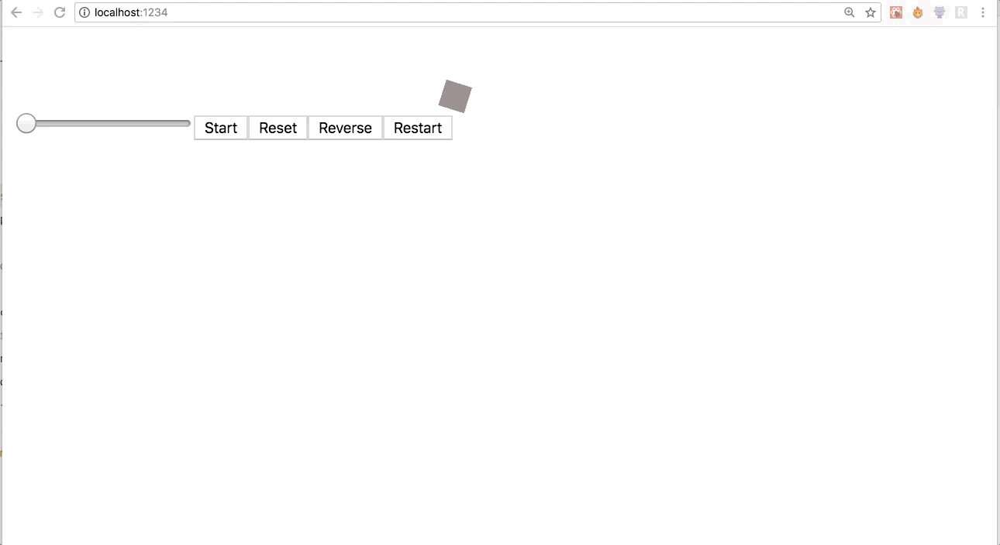

## Playback based animations

`Timeline` also provides playback controls to control the execution of an animation via `start` and `stop` methods. Let's take an example -

```js
import React, { Component } from "react";

import { Timeline, helpers } from "animated-timeline";

const { start } = helpers;

const timeline = new Timeline({
  direction: "alternate",
  easing: "easeInOutSine",
  loop: true,
  duration: 2000
});

const { Animated } = timeline.init();

class App extends Component {
  componentDidMount() {
    Animated.value({
      elements: this.one,
      translateX: start({ from: 500, to: 10 }),
      opacity: start({ from: 0.4, to: 0.9 }),
      rotate: {
        value: 360,
        easing: "easeInOutSine"
      }
    });
  }

  render() {
    const styles = {
      width: "20px",
      height: "20px",
      backgroundColor: "pink"
    };

    return (
      <React.Fragment>
        <div ref={one => (this.one = one)} style={styles} />
        <button onClick={e => Animated.start()}>Play</button>
        <button onClick={e => Animated.stop()}>Pause</button>
      </React.Fragment>
    );
  }
}
```

<p align="center">
  
</p>

With `start` and `stop` methods, `Timeline` also provides -

* `Animated.restart()` - To replay the animation

* `Animated.reset()` - To reset animation timeline

* `Animated.reverse()` - To reverse the animation

### Demo

Given below is a demo which shows `restart`, `reverse`, and `reset` in action.

<p align="center">
  
</p>
