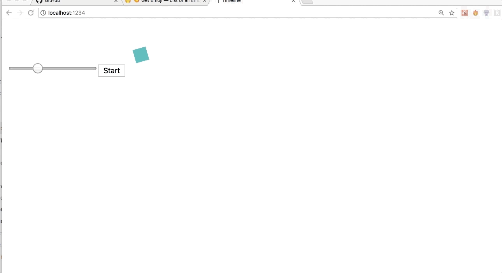

## Using `AnimationTimeline` component and driving updates through setState

Remember, `timeline.init()` initialises an `Animated` object to bind animation values and an `AnimationTimeline` component. `AnimationTimeline` is a React component which represents the timeline of the current animation. It is used to manage the lifecycle of the current animation and also accepts props to dynamically `start`, `stop`, `reverse`, `reset`, `restart` and change the animation's current progress.

[Read here about changing the animation progress value using `AnimationTimeline` component](./progress.md).

Let's take an example to control time-based execution of the current animation via component state instead of using the instance methods `start`, `stop`, `reverse`, `reset`, `restart`, which are available on `Animated`.

```js
import React, { Component } from "react";

import { Timeline, helpers } from "animated-timeline";

const { start, startBefore } = helpers;

const timeline = new Timeline({
  direction: "alternate",
  reversed: true,
  easing: "linear",
  duration: 2000,
  loop: true
});

const { Animated, AnimationTimeline } = timeline.init();

class App extends Component {
  state = {
    value: 0,
    playing: false,
    reset: false,
    reverse: false,
    restart: false
  };

  componentDidMount() {
    Animated.value({
      elements: this.one,
      translateX: start({ from: 0, to: 600 }),
      opacity: 0.8,
      rotate: {
        value: 360,
        easing: "easeInOutSine"
      }
    });
  }

  handleChange = e => this.setState({ value: e.target.value });

  render() {
    const boxStyles = {
      width: "20px",
      height: "20px",
      backgroundColor: "mistyrose"
    };

    return (
      <React.Fragment>
        <AnimationTimeline
          lifecycle={{
            onUpdate: ({ progress }) => {
              // This is hacky (but we also can't use setState here)
              this.state.value = isNaN(progress) ? this.state.value : progress;
            }
          }}
          start={this.state.playing}
          stop={!this.state.playing}
          seek={ctrl => ctrl.default(this.state.value)}
        />
        <div ref={one => (this.one = one)} style={boxStyles} />
        <input
          type="range"
          min="0"
          max="100"
          value={this.state.value}
          onChange={this.handleChange}
        />
        <button
          onClick={e => this.setState(state => ({ playing: !state.playing }))}
        >
          {this.state.playing ? "Stop" : "Start"}
        </button>
      </React.Fragment>
    );
  }
}
```

<p align="center">
  
</p>
